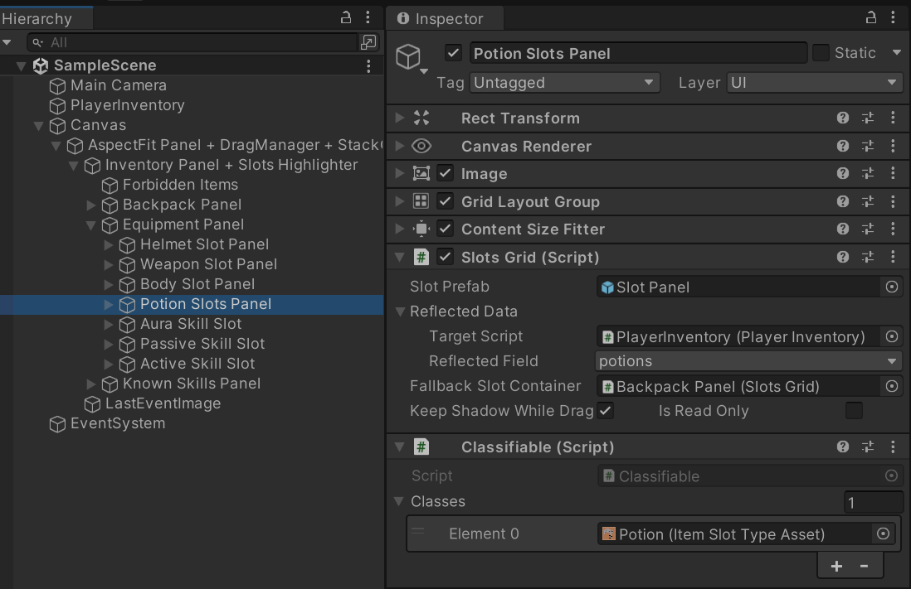
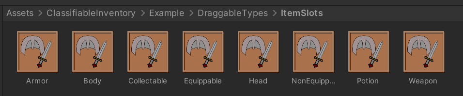
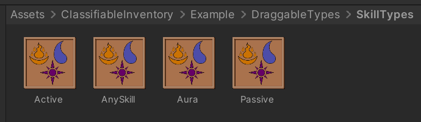
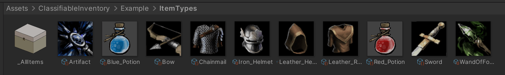
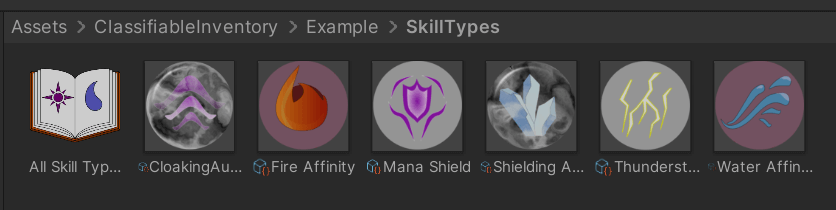

# Classifiable Inventory

Drag-and-Drop inventory system for Unity.

## Features

- Add a single slot or place them in grid on Canvas.

- Define traits using ScriptableObjects

- Specify traits on draggable object definitions

